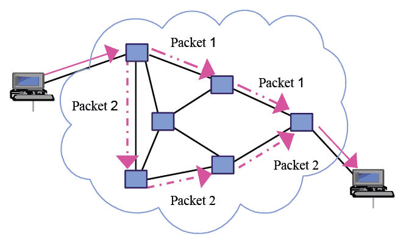
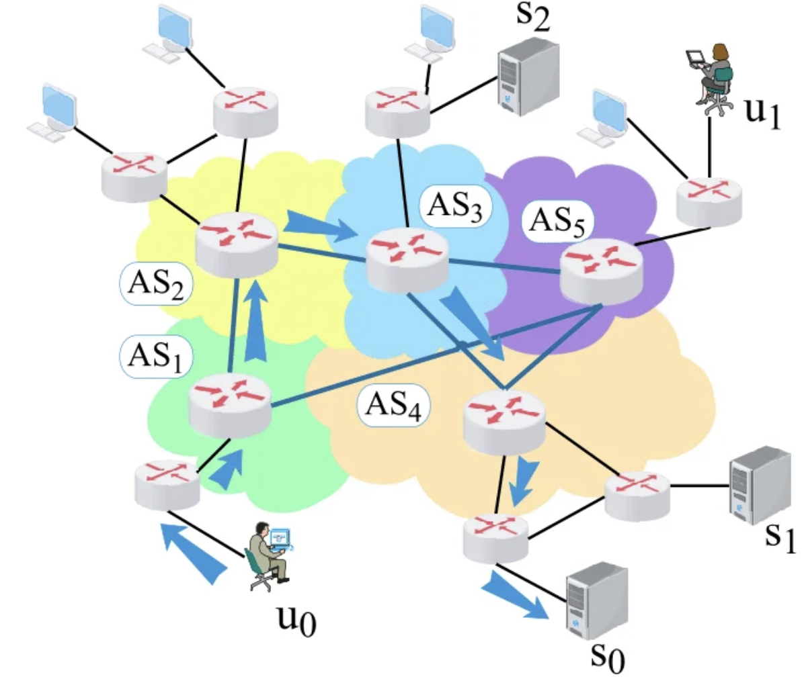
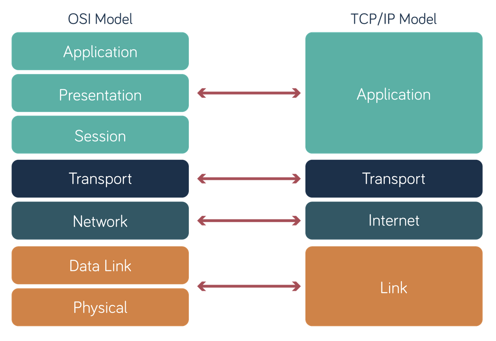
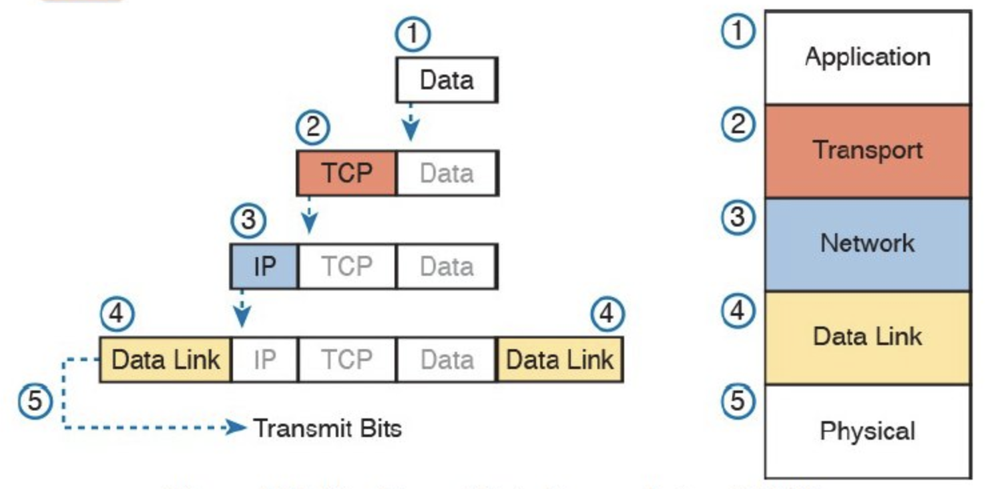

## Land Acknowledgement
We wish to acknowledge this land on which the University of Toronto operates.
For thousands of years it has been the traditional land of the Huron-Wendat,
the Seneca, and most recently, the Mississaugas of the Credit River. Today,
this meeting place is still the home to many Indigenous people from across
Turtle Island and we are grateful to have the opportunity to work on this land.

## Who Are We?

<br>

::: {layout-ncol=3}


:::

# Getting to Know You

::: {.notes}
students can complete and hand in at any point in the day
:::

# Icebreaker!

## Be Respectful!!!

- One voice at a time
- Physical boundaries
- Different abilities and identities
- Zero tolerance of violence and illicit substances
- Phones on silent


::: {.fragment .fade-in}
[*Speak up if you see a problem!!!*]{.highlight-red}

Can anyone think of anything else?
:::

# The Project

::: {.notes}
explain sickkids project

demo the lossy app
:::

## Course Structure

First 3 days: Lossy

- C and Javascript basics
- Program the Arduino
- Create the mobile app (React Native/Expo)

Last 2 days: Lossless

- Apply the theory!
- Optimization & Cybersecurity

## Lectures

University style

- Mixed lectures
- Tutorial following lectures
- Slides available at https://deep-future-fit-day1.netlify.app/

::: {.notes}
switch day
:::

## Prizes

The top 5 students will receive prizes!

- 3/2/1 points for Blooket reviews
- 1 point per challenge question completed
- 1 point per worksheet completed
- 1 point for participating in discussions or asking a question at least once per day

# The Internet [Click Me!]()

##

{fig-align=center}

##

{fig-align=center}

## Buzzwords

- HTTP/HTTPS
- IP address
- DNS
- SSL Certificates
- VPNs
- TCP/UDP
- Port Forwarding

Are there any others you've heard about?

## Networking Layers

{fig-align=center}

## Packet Encapsulation
{fig-align=center}

## Packet Loss
Packet loss is when a packet is not successfully delivered from one network device to another.

It can occur for a variety of reasons:

- Network congestion
- Router failure
- Took too long
- Firewalls
- ... and more

## Transmission Control Protocol (TCP)
A protocol that provides [*reliable*]{.highlight-red} and [*ordered*]{.highlight-red} delivery of data between two devices.

::: {.fragment .fade-in}
Key Ideas:

- [Acknowledgements]{.highlight-red}
- [Sequence numbers]{.highlight-red}
- Congestion control
- Error detection
- and more...
:::

# Pass the Message

## Instructions

Get into groups of [six]{.highlight-red}, and decide which roles you will be.

<br>

There needs to be 1 client, 1 server, 3 links, and 1 interferer.

## Round 1

The client will secretly decide on a sentence to send to the server.

When the round starts, they will write [each letter]{.highlight-red} on a flashcard and pass them to links.

The links will try to pass it to the server.

The server collects all flashcards [in order]{.highlight-red}.

The interfer can stand beside a link and steal flashcards from them or request they slow down, the links must comply!

The server reveals the sentence it has in the end.

## Round 2
Swap roles!

<br>

The server now upon receiving a flashcard sends a flashcard back to the client as an acknowledgement using the links.

<br>

The client can use this acknowledgement as they see fit.

<br>

Remember, the goal is to make sure the server receives all flashcards in the correct order.

## Round 3
Swap roles again!

<br>

The client marks each flashcard with the letter's position in the sentence
(e.g. is it the first, second, third, etc.).

<br>

The server, as part of its acknowledgement, will now include the letter's position as part of its message.

# Talk it out

# Lunch

# Icebreaker

# What is Coding?

::: {.notes}
how many have you coded before?
:::

## Terminal
The terminal is a text-based interface for interacting with the operating system.

<br>

It is the "frontend" for the shell.

<br>

The shell is the "backend" for the terminal.

## Shell

Most common shells:

- sh
- bash
- zsh

```bash
echo "Hello, World!"
```

Typing this into the terminal will run the `echo` command, which
is a program somewhere on your computer.

:::{.notes}
demo the shell
:::

## Code Editor
A text editor specialized for code

<br>

Terminal-based code editors: `vim`, `nano`, `emacs`, ...

<br>

Graphical code editors: `Sublime Text`, `Atom`, `VS Code`, ...

<br>

IDEs: `VS Code`, `PyCharm`, `IntelliJ`, ...

:::{.notes}
demo some of these
:::

## Git and Github
Git is a version control system that allows you to track changes to your code.

<br>

Github is a web-based hosting service for Git repositories. It allows you to store and share your code with others.

<br>

Git is **NOT** Github.

:::{.notes}
show them the github
:::

# C Playground (TODO)

::: {.notes}
hand out laptops

as i am speaking, feel free to play around with C in a C playground
:::

## Variables
```{.c}
int age = 25; // creating a variable called age
```

<br>

::: {.fragment .fade-in}
Computer Memory:

| Address | Label | Value |
|---------|-------|-------|
| 0x23c   |       |       |
| 0x240   |       |       |
| 0x244   |       |       |
| 0x248   |       |       |
:::

::: {.notes}
break down each part of the statement using ipad

fill out table
:::

##
<br>
<br>
<br>
<br>
<br>
<br>

Variables are like [little boxes]{.highlight-red} inside your computer

## Data Types
Every variable has a type of value it can store

```{.c code-line-numbers=1|3|5|9|11-12|14-15}
char letter = 'C';                // 1 byte
short small_num = 2500;           // 2 bytes
int age = 25;                     // 4 bytes (most common integer type)
long big_population = 7800000000; // 8 bytes
uint8_t positive_only = 100; // 8 bits (aka 1 byte), positive numbers only

// Floating-point types for decimal numbers.
float pi_approx = 3.14f;          //  4 bytes (note the 'f')
double precise_pi = 3.14159265359; // 8 bytes

// Numbers can also be used to represent false/off and true/on
int is_completed = 1; // 0 is false, 1 is true

// Constants cannot be modified after declaration.
const int BIRTH_YEAR = 1999;
```

## Printing to the Screen
```{.c}
// Print using format specifiers that match the data type.
printf("char:        %c\n", letter);
printf("int:         %d\n", age);
printf("unsigned:    %u\n", positive_only);
printf("double:      %.2f\n", precise_pi); // .2 limits decimals
```

Output in the terminal:

```
char:        C
int:         25
unsigned:    100
double:      3.14
```

::: {.notes}
- can have as many as you want
- newline character
:::

##
<br>
<br>
<br>
<br>
<br>
<br>

The equals sign (=) is [assignment!!!]{.highlight-red}

::: {.notes}
x = 3
x = 4
math vs coding
:::

## Operations

- Arithemtic
- Relational
- Logical
- Bitwise

## Arithemtic Operators

```{.c}
int a = 10;
int b = 3;
printf("  %d + %d = %d\n", a, b, a + b);
printf("  %d - %d = %d\n", a, b, a - b);
printf("  %d * %d = %d\n", a, b, a * b);
printf("  %d / %d = %d  (integer division)\n", a, b, a / b);
```

What is the output?

::: {.fragment .fade-in}
```
10 + 3 = 13
10 - 3 = 7
10 * 3 = 30
10 / 3 = 3  (integer division)
10 % 3 = 1  (remainder)
```
:::

::: {.notes}
break down the printf statement
:::

## Assignment
When assigning a value to a variable, we always evaluate the right hand side first.

```{.c}
int x = 0;
x = x + 1; // Compute x + 1 first, then assign the result to x
x += 1; // Shorthand for the above
x++; // Shorthand for the above
```

## Relational Operators

Compares two values and returns `1` (true) or `0` (false).

```{.c}
// Relational operators: ==, !=, <, >, <=, >=
printf("  10 == 10 : %d\n", 10 == 10);
printf("  10 != 5  : %d\n", 10 != 5);
printf("  10 <= 5  : %d\n\n", 10 <= 5);

```

What is the output?

::: {.fragment .fade-in}
```
10 == 10 : 1
10 != 5  : 1
10 <= 5  : 0
```
:::

::: {.fragment .fade-in}
[Double equals is mathematical equality!!!]{.highlight-red}
:::

::: {.notes}
explain what each operator means
:::

## Logical Operators

Combines or manipulates boolean values and returns `1` (true) or `0` (false).

```{.c}
// Logical operators: && (AND), || (OR), ! (NOT)
printf("  (1 && 1) = %d\n", 1 && 1);
printf("  (1 || 0) = %d\n", 1 || 0);
printf("  !1       = %d\n\n", !1);
```

What is the output?

::: {.fragment .fade-in}
```
(1 && 1) = 1
(1 || 0) = 1
!1       = 0
```
:::

## Truth Table

<br>

| A | B | A && B | A \|\| B | !A |
|---|---|:------:|:--------:|----|
| 0 | 0 |   ?    |     ?    |  ? |
| 0 | 1 |   ?    |     ?    |  ? |
| 1 | 0 |   ?    |     ?    |  ? |
| 1 | 1 |   ?    |     ?    |  ? |


## Truth Table

<br>

| A | B | A && B | A \|\| B | !A |
|---|---|:------:|:--------:|----|
| 0 | 0 |   0    |     0    |  1 |
| 0 | 1 |   0    |     1    |  1 |
| 1 | 0 |   0    |     1    |  0 |
| 1 | 1 |   1    |     1    |  0 |

## Conditionals
If and only if a condition is true, then the code inside is executed.
```{.c}
int score = 85;

if (score >= 90) {
    printf("Grade A\n");
} else if (score >= 80) {
    printf("Grade B\n");
} else if (score >= 70) {
    printf("Grade C\n");
} else {
    printf("Grade F\n");
}
```

What does this print?

::: {.notes}
B then C then F
scratch out the first elif branch, then the second
:::

## Arrays
```{.c}
int arr[3] = {0, 1, 2};
```

<br>

Computer Memory:

| Address | Label | Value |
|---------|-------|-------|
| 0x23c   |       |       |
| 0x240   |       |       |
| 0x244   |       |       |
| 0x248   |       |       |

::: {.notes}
break down each part of the statement

fill out table
:::

##

<br>
<br>
<br>
<br>
<br>
<br>

Arrays are like [bins]{.highlight-red} to store boxes.

## Arrays
```{.c}
// Declare and initialize an array of integers.
int numbers[ARRAY_SIZE] = {10, 20, 30, 40, 50};

// Access elements by index (0-based).
printf("Integer array: %d %d %d %d %d\n", numbers[0], numbers[1], numbers[2], numbers[3], numbers[4]);
```

| Index | 0 | 1 | 2 | 3 | 4 |
|-------|---|---|---|---|---|
| Value | 10 | 20 | 30 | 40 | 50 |

Output:

::: {.fragment .fade-in}
```
Integer array: 10 20 30 40 50
```
:::

::: {.fragment .fade-in}
[Arrays cannot be reassigned!!!]{.highlight-red}

```{.c}
numbers = {40, 30, 20}; // will cause an error
```
:::

::: {.notes}
:::

## Strings
Strings are character arrays...

::: {.fragment .fade-in}
[with a NULL terminator `\0` at the end!!!]{.highlight-red}

```{.c code-line-numbers=|1|2|3|4|}
int arr[] = {0, 1, 2};
char s1[3] = {'a', 'b', 'c'} ;// is this a string?
char s2[3] = {'a', 'b', '\0'}; // is this a string?
```

:::: {.fragment .fade-in}
String literals are created using double quotes. They include
a null terminator unless there's not enough space.
```{.c code-line-numbers=|1|2|}
char s1[3] = "ab"; // is this a string?
char s2[3] = "abc" // is this a string?
```
::::
:::

## Functions
Functions are like virtual machines

```{.c}
int increment(int x); // Declaration

int increment(int x) {
    x = x + 1; // Definition
}

int n = 84;
n = increment(n); // Call the function
```

`x` is a parameter, `n` is an argument

A parameter is a variable that has no value until given one

If you don't want your function to return anything, use `void`

::: {.notes}
get a volunteer?

break down each part of the function statement
:::

## String Functions
```{.c code-line-numbers=|1|3-4|6-9|11-12}
char greeting[MAX_STRING_SIZE] = "Hello, world!";

printf("String: %s\n", greeting);
printf("Length: %lu characters\n", strlen(greeting));

char copy[MAX_STRING_SIZE];

strcpy(copy, greeting);               // Copy
printf("Copy:   %s\n", copy);

strcat(copy, " How are you?");        // Concatenate
printf("Concat: %s\n", copy);
```

Output:

```
String: Hello, world!
Length: 13 characters
Copy:   Hello, world!
Concat: Hello, world! How are you?
```

## Structs
A struct is a collection of variables (members) of possibly different types.

```{.c code-line-numbers=|1-5|7-11|13-17}
struct Student {
    char name[MAX_STRING_SIZE];
    int  id;
    double grade;
};

// Declare and initialize a struct variable.
Student student1;
strcpy(student1.name, "Ada Lovelace"); // why do i have to use strcpy here?
student1.id = 101;
student1.grade = 97.5f;

// Access members using the dot (.) operator.
printf("Student 1:\n");
printf("  Name:  %s\n", student1.name);
printf("  ID:    %d\n", student1.id);
printf("  Grade: %.1f%%\n", student1.grade);
```

## Loops
Loops repeat a piece of code some number of times
```{.c code-line-numbers=|2|3|2|3|2|3|2|3|5|}
printf("\nfor loop (i from 0 to 3): ");
for (int i = 0; i < 4; i++) {
    printf("%d ", i);
}
printf("\n");

printf("while loop (count from 3 to 0): ");
int count = 3;
while (count > 0) {
    printf("%d ", count);
    count--;
}
printf("%d\n", count);
```

What is the output?

::: {.fragment .fade-in}
```
for loop (i from 0 to 3): 0 1 2 3
while loop (count from 3 to 0): 3 2 1 0
```
:::

## Break/Continue
These keywords allow us to end the loop early and skip ahead respectively.

```{.c}
printf("break/continue demo (odd numbers < 7): ");
for (int i = 1; i <= 10; i++) {
    if (i == 7) break;      // Exit loop completely
    if (i % 2 == 0) continue; // Skip even numbers
    printf("%d ", i);
}
```

What is the output?

::: {.fragment .fade-in}
```
break/continue demo (odd numbers < 7): 1 3 5
```
:::

# Careful of infinite loops!

## Includes
We often have to borrow other people's code to write our own.

We can do that using `#include`
```{.c}
#include <stdio.h>   // Standard Input/Output (e.g. printf)
#include <string.h>  // String functions (e.g. strcpy, strlen)
```

## Compilation
We use the compiler to translate English into machine instructions.

```{.bash}
gcc source_code.c -o name_of_executable
```

`gcc` is the compiler program

`source_code.c` is our code

`-o` means *output* the executable to a file called \<whatever comes after\>

::: {.notes}
show them how to compile?
:::

# Tutorial
